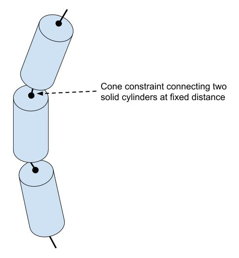
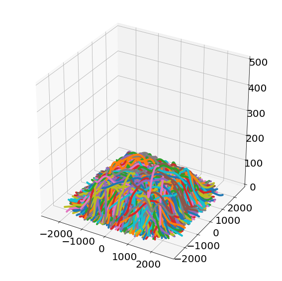

# Carbon nanotube mesh

This repo contains code that is used in creating large mesh of carbon nanotube fibers. The generated mesh is used in a Monte Carlo simulation to study transport properties of the CNT film. 

# Overview
The mesh generation is envisioned to be completed in multiple steps

1. [BulletPhysics](https://github.com/bulletphysics/bullet3) library is used to mechanically simulate CNT fibers that fall on top of each other. Each CNT fiber is considered as an array of solid cylinders that are connected to each other. The cylinders are connected to each other back to back via cone constraints. The cone constraints enforce the solid cylinders to maintain a minimum angle between their axes and as a result the CNT fiber would have an effective minimum curvature radius (see figure below). In the mechanical simulation, a small number of CNT fibers (comprised of a number of solid cylinders depending on the length of CNT fiber) are created on a fixed height and fall to the ground. This process is repeated over and over again and gradually the number of CNT fibers in the simulation grow and a virtual container is filled with randomly oriented CNT fibers. The length of the CNT fibers can be chosen randomly between two limits (e.g. 400 nm and 1000 nm). Additionally the length of the solid cylinders and the initial orientation of the CNT fibers can be chosen randomly. We need to repeat this process until we have enough volume to be able to study macroscopic bulk properties such as diffusion coefficient of excitons/electrons 

2. Ideally, we would want to do this simulation with a very small cylinder height so that we would have a smooth curve for the CNT fiber coordinates. But due to the computational burden of the mechanical simulation with two many moving parts, we have to choose a large cylinder height such as 100 nm, and use interpolation to create the coordinates of the CNT fibers with higher definition. We call this new interpolated coordinates *fine mesh* of CNT fibers. In order to do the interpolation, we use the coordinates of mid-point of each cylinder and its axis orientation and use a spline function to create a smooth curve for each CNT fiber.   

3. Coordinates of individual CNTs inside each fiber are calculated by shifting the coordinates of the center axis of the fiber in a direction perpendicular to the axis. Therefore, in the plane perpendicular to the axis of the fiber, the CNTs form a hexagonal lattice. See this [link](http://htmlpreview.github.io/?https://github.com/amirhosseindavoody/carbon_nanotube_mesh/blob/cone_constraint/figures/single_fiber_with_individual_CNTs.html) for an interactive visualization of the shifting process. Use your mouse scroll to zoom in and see individual CNTs within the fiber. I have used [Plotly](https://plot.ly/python/) library to create this figure.

> As noted before we need to create a large enough mesh that we are able to extract bulk properties (such as diffusion coefficient and mobility) and not be affected by local properties of the simulated structure. In my experience, such a large structure requires massive computational resources not available to us. So, a workaround would be to create numerous versions of smaller CNT film using various random number seeds and simulate  smaller individual films and average over the end transport properties results. I will discuss some tricks to enhance the quality of Monte Carlo simulation results with smaller size films.

# Repository structure

The following files and directories exist in the repository:
- `cpp_analyze`: The contents of this folder are small `cpp` codes that are used to calculate statistics about the generated fiber or CNT mesh.
- `cnpy`: Small `cpp` library, that enables writing arrays into `.npy` format that is also used in python's numpy library. This library facilitate easier interoperability between `cpp` code and python codes.
- `figures`: Some figures used in this readme file
- `lib`: Source code for some helper libraries. At this point, only a header-only library for reading `json` files is used.
- `input.json`: Input file to determine the BulletPhysics simulation input parameters.
- `src`: This directory contains the source `cpp` code for the BulletPhysics simulation. 
- `misc_files`: These are the files that are used in creating the BulletPhysics simulation. You don't need to change anything in this folder, but the code in `src` folder relies on the code and classes defined in this folder.
- `notes`: Some useful notes that I took while working on this repository. There are some latex formulas, so read the notes in an editor that can render latex/`katex` formulas.
- `python_scripts`: The python classes and functions that I wrote for visualization and analysis described in section 2 and 3.
- `cnt_mesh.ipynb`: The Jupyter notebook that I used to execute analysis in steps 2 and 3. The content could be rough as this was a work in progress.
- `makefile`: Makefile for compiling the `cpp` code (BulletPhysics simulation). The assumption is that you have installed the required dependencies.

# Dependencies
In order to compile the `cpp` code you need to install the following dependencies on your computer
- `Armadillo`: A library for doing linear algebra calculations in `cpp`. [Here](http://arma.sourceforge.net/) is their homepage with instructions on how to install it.
- `BulletPhysics`: This one is a little bit tricky so I have put some notes in a special [wiki page](https://github.com/amirhosseindavoody/carbon_nanotube_mesh/wiki) dedicated to how to use this library.